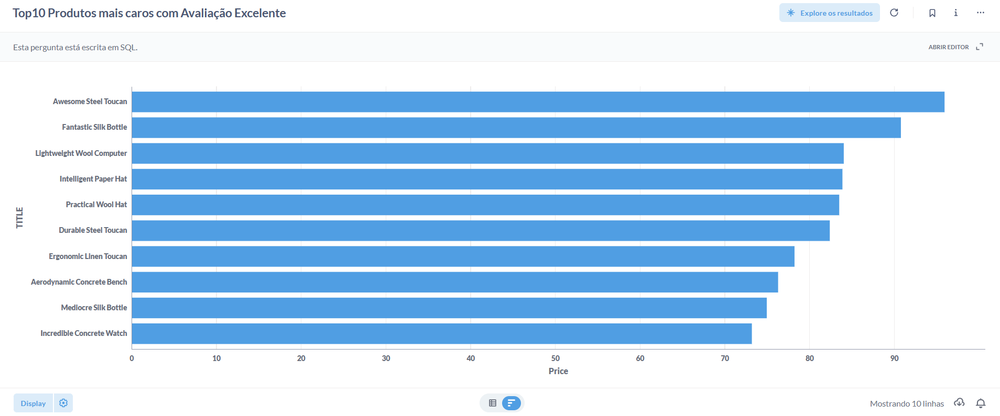

# 📊 Top 10 Produtos Mais Caros com Avaliação Excelente (SQL)

Este repositório apresenta uma análise de dados realizada em **SQL**, utilizando o **Metabase** disponibilizado pela **Escola DNC**, com o objetivo de identificar os **10 produtos mais caros que possuem avaliação excelente**.

---

## 🎯 Objetivo da Análise

Identificar quais são os **produtos de maior valor** dentro da base de dados que apresentam **avaliação superior a 4**, auxiliando na tomada de decisão estratégica, análise de portfólio e entendimento do posicionamento de produtos premium.

---

## 🗂️ Ambiente de Dados

- **Plataforma:** Metabase (DNC)
- **URL:** https://dex.dnc.group/browse
- **Banco de dados:** DNC (ambiente educacional)
- **Tabela analisada:** `Products`

---

## 📋 Estrutura da Tabela `Products`

Principais colunas utilizadas na análise:

- `ID` — Identificador único do produto  
- `TITLE` — Nome do produto  
- `CATEGORY` — Categoria do produto  
- `Price` — Preço do produto  
- `Rating` — Avaliação média dos clientes  

---

## 🧠 Critérios Utilizados

- Apenas produtos com **avaliação maior que 4**
- Ordenação por **preço decrescente**
- Retorno dos **10 produtos mais caros**

---

## 🧾 Query SQL Utilizada

```sql
SELECT 
    ID,
    TITLE,
    CATEGORY,
    Price
FROM Products
WHERE Rating > 4
ORDER BY Price DESC
LIMIT 10
```
---

## 📈 Visualização dos Dados

A consulta foi visualizada no **Metabase** através de um **gráfico de barras horizontais**, facilitando a comparação dos preços entre os produtos selecionados.

---

## 🖥️ Dashboard



## 📌 Principais Insights

- Produtos premium conseguem manter **avaliações excelentes**, reforçando a importância da **qualidade percebida**.
- Há **diversidade de categorias** entre os produtos de maior valor.
- O **preço elevado não impactou negativamente** a avaliação dos clientes.

---

## 🛠️ Ferramentas Utilizadas

- **SQL**
- **Metabase**
- **Base de dados educacional DNC**

---

## 👩‍💻 Autor
> Este projeto faz parte do meu portfólio de estudos em Análise de Dados, com foco em SQL e visualização de dados.


